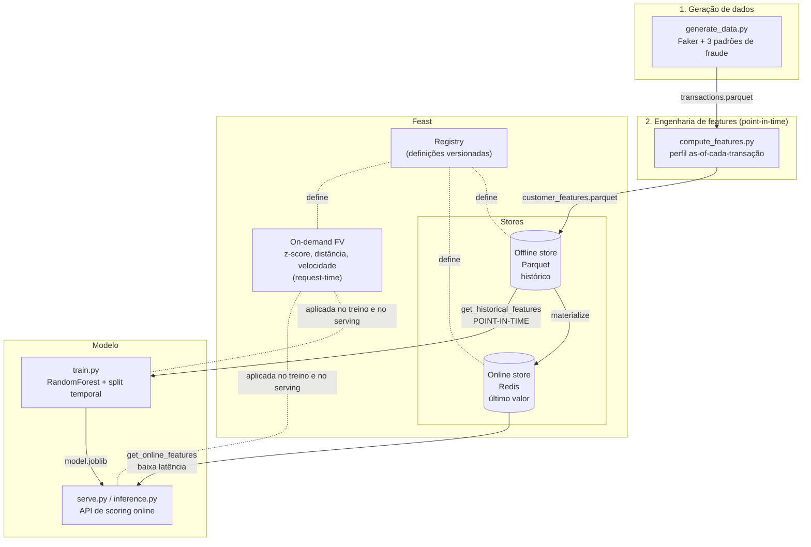

# Fraud Feature Store

Uma **feature store de ponta a ponta** para detecção de fraude em transações
financeiras, construída com [Feast](https://feast.dev) (open source), **Redis**
(online store), **Parquet** (offline store) e **scikit-learn** — tudo
containerizado e com CI que prova o ciclo completo.

O objetivo não é o modelo de fraude em si (ele é deliberadamente simples), e sim
demonstrar **a infraestrutura de features**: por que ela existe, como offline e
online se conectam, e como garantir *point-in-time correctness* para não vazar o
futuro no treino.

> Para defender este projeto numa entrevista: comece por
> [`docs/STUDY_GUIDE.md`](docs/STUDY_GUIDE.md) (conceitos + perguntas e respostas)
> e [`docs/REBUILD_ROADMAP.md`](docs/REBUILD_ROADMAP.md) (como reconstruir cada
> parte mentalmente).

---

## O problema que uma feature store resolve

Sem feature store, dois times reimplementam a mesma feature duas vezes: o time de
ciência de dados calcula "ticket médio do cliente" em batch para treinar, e o time
de produção recalcula "ticket médio do cliente" em tempo real para servir. As duas
implementações divergem — fórmulas, janelas, fusos — e o modelo passa a ver em
produção números diferentes dos que viu no treino. Isso é **training/serving
skew**, e é uma das causas mais comuns de "o modelo era ótimo no notebook e
péssimo em produção".

A feature store resolve isso sendo a **fonte única de verdade** das features, com:

- uma **offline store** (histórico, alto volume) para montar datasets de treino;
- uma **online store** (último valor, baixa latência) para servir inferência;
- **definições versionadas** das features (um *registry*);
- **point-in-time joins** corretos por construção, para não vazar o futuro.

---

## Arquitetura



**O fluxo em uma frase:** geramos transações → calculamos o perfil histórico de
cada cliente sem vazar o futuro → registramos as definições no Feast → o histórico
vira dataset de treino via *point-in-time join* e é **materializado** para o Redis
→ o modelo treina offline e serve online lendo as **mesmas features**.

---

## Componentes e o "porquê" de cada um

| Componente | Arquivo | Por que existe |
|---|---|---|
| Geração de dados | `src/fraud_fs/generate_data.py` | Controlar a verdade de base: injetamos fraude (valor fora do perfil, sequência rápida, viagem impossível) para *provar* que as features capturam o sinal. |
| Transformações puras | `src/fraud_fs/transforms.py` | Haversine, z-score, velocidade num só lugar — usadas no offline E no online. É o que mata o training/serving skew por construção. |
| Features offline | `src/fraud_fs/compute_features.py` | Calcula o perfil do cliente **as-of cada transação**, usando só o passado (`shift(1)`). É a implementação concreta do point-in-time correctness. |
| Definições Feast | `feature_repo/definitions.py` | Declara entidade, fontes, a FeatureView de perfil e a **on-demand feature view** de risco (calculada no request). |
| Offline store | Parquet via `FileSource` | Histórico para treino. Otimizado para varrer muito dado, não para latência. |
| Online store | Redis | Último valor por conta, leitura em ~1 ms para servir inferência. |
| Registry | `data/registry.db` | Catálogo versionado das definições — a "fonte de verdade" do que existe. |
| Treino | `src/fraud_fs/train.py` | Consome o dataset point-in-time; split **temporal**, métricas de classe desbalanceada. |
| Serving | `src/fraud_fs/inference.py` + `serve.py` | Fecha o ciclo: lê o online store + on-demand transforms e pontua via API. |

---

## Features calculadas

**Perfil do cliente** (batch, `customer_profile` — point-in-time):
`amount_avg`, `amount_std`, `txn_count_1h`, `txn_count_24h`,
`txn_count_lifetime`, `last_txn_lat`, `last_txn_lon`, `last_txn_unixtime`.

**Risco da transação** (on-demand, `transaction_risk` — calculada no request):
`amount_zscore` (desvio do padrão histórico), `amount_to_avg_ratio`,
`distance_from_last_km`, `seconds_since_last`, `velocity_kmh` (viagem impossível).

---

## Como rodar

### Opção A — Docker Compose (recomendada)

```bash
cd fraud-feature-store
docker compose up --build
```

Sobe `redis`, roda o `pipeline` completo (gera → materializa → treina → demonstra)
e então levanta a `api` em `http://localhost:8000`. Teste:

```bash
curl -s -X POST http://localhost:8000/score \
  -H 'content-type: application/json' \
  -d '{"account_id":"ACC000001","amount":9000,"lat":35.68,"lon":139.69}'
```

### Opção B — Local

```bash
cd fraud-feature-store
python -m venv .venv && source .venv/bin/activate
make setup           # pip install -e ".[dev]"
redis-server --daemonize yes
make pipeline        # gera -> features -> apply -> materialize -> treina -> demo
make serve           # API em http://localhost:8000
```

Cada etapa também roda isolada: `make data`, `make features`, `make apply`,
`make materialize`, `make train`, `make demo`. Veja `make help` (alvos comentados).

### Testes e lint

```bash
make test    # pytest (unitários, sem Redis)
make lint    # ruff + black
```

---

## Resultado de exemplo

Demo de inferência online (transação normal vs. valor altíssimo em Tóquio 10 min
após uma compra local):

```
[normal]   valor=R$ 188.45 perto de casa     p(fraude)=0.040 -> fraude=False
[suspeita] valor=R$15076.00 em Tóquio 10min depois p(fraude)=0.765 -> fraude=True
  z-score do valor : 34.3
  distância (km)   : 18221
  velocidade (km/h): 2,956  <- viagem impossível
```

Hold-out temporal: **ROC-AUC ~0.99, PR-AUC ~0.9**. As features mais importantes
são exatamente os sinais injetados (`amount_to_avg_ratio`, `velocity_kmh`,
`amount_zscore`) — evidência de que a pipeline de features funciona.

---

## Trade-offs das escolhas (o que eu defenderia numa entrevista)

**Offline store = Parquet (e não Postgres/BigQuery).**
Parquet é simples, sem servidor, colunar e ótimo para um portfólio reprodutível.
O custo: não escala para times concorrentes nem para joins gigantes, e não tem
governança/SQL ad-hoc. Em produção real, eu usaria um data warehouse
(BigQuery/Snowflake) ou Postgres como offline store — o Feast troca isso só no
`feature_store.yaml`, sem mexer no resto. *A arquitetura está preparada; a escolha
é pragmática.*

**Online store = Redis.**
Key-value em memória, leitura em ~1 ms — ideal para servir features. Custo: é
memória (caro em volume) e precisa de estratégia de persistência/HA. Alternativas:
DynamoDB (gerenciado, escala melhor, latência um pouco maior) ou um cache local
para features quase-estáticas.

**Computação de features fora do Feast.**
O Feast OSS armazena e serve features; ele não as computa por você (engine de
transformação batch é limitada). Por isso a engenharia de feature vive num
pipeline próprio (`compute_features.py`). Trade-off: mais controle e testabilidade,
porém eu sou responsável pela orquestração (aqui um script; em produção,
Airflow/Dagster) e pela frescura dos dados (re-materializar periodicamente).

**On-demand feature view para z-score/velocidade.**
Essas features dependem da transação que está chegando (valor, local, hora), então
não dá para pré-computar — têm que ser calculadas no request. Trade-off: somam
latência por request (pequena aqui) e o Feast marca ODFV como experimental para
*offline retrieval* em grande escala. O ganho: zero skew, porque a MESMA função
roda no treino e no serving.

**Modelo = RandomForest simples.**
O foco é a feature store, não o modelo. RandomForest captura interações não
lineares (thresholds de z-score, velocidade), dá `feature_importances_` para
interpretar e roda sem tuning. `class_weight="balanced"` lida com o
desbalanceamento (~1,5% de fraude). Em produção eu compararia com
GradientBoosting/XGBoost e calibraria o threshold pelo custo de falso
positivo/negativo, não em 0.5.

**Split temporal (e não aleatório).**
Fraude é temporal: treinar no passado, testar no futuro. Um split aleatório
vazaria padrões futuros e inflaria as métricas. O custo é menos dados de treino
"recentes", mas é o único split honesto aqui.

**Dados sintéticos (Faker).**
Permitem controlar a verdade de base e tornam o projeto 100% reprodutível (via
`SEED`). Custo: não têm a sujeira/sutileza de fraude real; o desempenho aqui é
otimista comparado ao mundo real.

---

## Estrutura

```
fraud-feature-store/
├── src/fraud_fs/
│   ├── transforms.py        # funções puras (offline == online)
│   ├── config.py            # caminhos, escala, referências de feature (fonte única)
│   ├── generate_data.py     # 1. dados sintéticos + fraude injetada
│   ├── compute_features.py  # 2. features point-in-time
│   ├── store.py             # fábrica do FeatureStore
│   ├── pipeline.py          # 3+4. feast apply / materialize
│   ├── offline.py           # 3. dataset de treino (get_historical_features)
│   ├── train.py             # 5. modelo
│   ├── inference.py         # 6. scoring online (get_online_features)
│   └── serve.py             # API FastAPI de serving
├── feature_repo/
│   ├── feature_store.yaml   # config (registry, offline, online)
│   └── definitions.py       # entidade, feature views, on-demand FV
├── tests/                   # unitários (foco: prova de não-leakage)
├── scripts/run_pipeline.sh  # orquestração one-shot
├── Dockerfile / docker-compose.yml
├── Makefile
└── docs/
    ├── STUDY_GUIDE.md       # conceitos + perguntas de entrevista
    └── REBUILD_ROADMAP.md   # como reconstruir mentalmente
```
